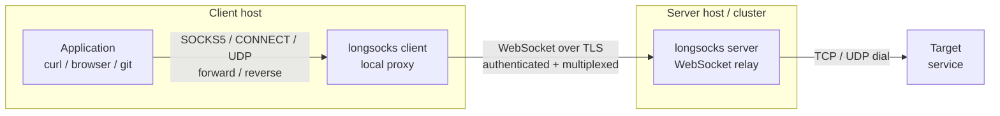

# longsocks

Authenticated proxy tunneled over WebSockets. A single Go binary that
provides SOCKS5, HTTP CONNECT, and multiplexed tunnel access. Designed
to work behind TLS-terminating infrastructure, including Kubernetes
ingresses (OpenShift Routes, NGINX Ingress, Traefik, Gateway API),
cloud load balancers, or standalone with built-in TLS.

## Why longsocks

SOCKS5 proxies relay traffic. longsocks adds identity-aware access
control and structured audit logging to a SOCKS5 proxy designed to
run without elevated privileges.

It operates entirely in userspace on unprivileged ports, and its
WebSocket transport works through any HTTP infrastructure already in
place — no special network configuration required:

- SOCKS5, HTTP CONNECT, and SOCKS5 UDP proxy modes in a single binary
- Multiplexed sessions, arbitrary port forwarding, and reverse tunnels
  over a single WebSocket
- Layered authentication: static tokens, multi-user token directory,
  built-in JWT with revocation, external OIDC (Entra ID, Okta,
  Keycloak), and mutual TLS
- Structured JSON audit logging with per-connection identity tracking
- Prometheus metrics and periodic aggregate stats
- Server fingerprint verification (Ed25519)
- Auto-reconnect with exponential backoff
- Designed for container-orchestrated environments: `FROM scratch`
  image, Kustomize manifests, health probes, non-root security context

If all you need is a minimal SOCKS5 proxy without authentication,
encrypted transport, metrics, or audit features, consider
[littlesocks](https://github.com/cloudygreybeard/littlesocks).

## Installation

### Homebrew (macOS/Linux)

```bash
brew install cloudygreybeard/tap/longsocks
```

### Go install

```bash
go install github.com/cloudygreybeard/longsocks@latest
```

### Container image

```bash
podman pull ghcr.io/cloudygreybeard/longsocks:latest
```

### From source

```bash
git clone https://github.com/cloudygreybeard/longsocks
cd longsocks
make build
```

## Quick start

Start a server and client with a shared token:

```bash
longsocks server --addr :8080 --token MY_SECRET
```

```bash
longsocks client --server wss://SERVER_HOSTNAME --token MY_SECRET
```

Replace `SERVER_HOSTNAME` with the hostname of your longsocks server.
Replace `MY_SECRET` with a shared bearer token.

Test it:

```bash
curl -x socks5h://127.0.0.1:1080 https://httpbin.org/ip
```

## Proxy modes

longsocks supports three proxy modes. The server can enable multiple
modes simultaneously; the client selects one mode per instance.

| Mode | Client flag | Server flag | Transport | Use case |
|---|---|---|---|---|
| `socks5` (default) | `--mode socks5` | `--modes socks5` | TCP | General-purpose SOCKS5 proxy for TCP traffic |
| `connect` | `--mode connect` | `--modes connect` | TCP | HTTP CONNECT proxy, compatible with `http_proxy` env and browser settings |
| `socks5-udp` | `--mode socks5-udp` | `--modes socks5-udp` | TCP + UDP | SOCKS5 with UDP ASSOCIATE for applications that require UDP (DNS, QUIC) |

### SOCKS5 mode (default)

Standard SOCKS5 proxy for TCP traffic. The client listens locally and
tunnels each connection through a WebSocket to the server.

Server:

```bash
longsocks server --addr :8080 --token MY_SECRET
```

Client:

```bash
longsocks client --server wss://SERVER_HOSTNAME --token MY_SECRET
```

Usage:

```bash
curl -x socks5h://127.0.0.1:1080 https://httpbin.org/ip
```

Many tools support SOCKS5 via environment variables:

```bash
export ALL_PROXY=socks5h://127.0.0.1:1080
git clone https://github.com/example/repo
```

### HTTP CONNECT mode

Exposes a local HTTP CONNECT proxy. This is the protocol understood by
`http_proxy`/`https_proxy` environment variables and most browser proxy
settings.

Server (enable the `connect` mode alongside others or on its own):

```bash
longsocks server --addr :8080 --token MY_SECRET --modes socks5,connect
```

Client:

```bash
longsocks client --mode connect --addr 127.0.0.1:8118 \
    --server wss://SERVER_HOSTNAME --token MY_SECRET
```

Usage:

```bash
curl -x http://127.0.0.1:8118 https://httpbin.org/ip
```

Or set the proxy system-wide:

```bash
export https_proxy=http://127.0.0.1:8118
export http_proxy=http://127.0.0.1:8118
curl https://httpbin.org/ip
```

### SOCKS5 UDP mode

Extends the SOCKS5 proxy with UDP ASSOCIATE support. TCP connections
work identically to the default SOCKS5 mode. UDP datagrams are relayed
through a dedicated WebSocket to the server's `/connect-udp` endpoint.

Server (enable `socks5-udp`):

```bash
longsocks server --addr :8080 --token MY_SECRET --modes socks5-udp
```

Client:

```bash
longsocks client --mode socks5-udp \
    --server wss://SERVER_HOSTNAME --token MY_SECRET
```

### Enabling all modes

The server can serve all modes simultaneously:

```bash
longsocks server --addr :8080 --token MY_SECRET \
    --modes socks5,connect,socks5-udp
```

## Tunneling

### Multiplexed sessions

By default, the client opens a new WebSocket for each proxied
connection. With `--mux`, the client establishes a single persistent
WebSocket and multiplexes all SOCKS5 connections over it using
[yamux](https://github.com/hashicorp/yamux). This reduces handshake
overhead and is required for port forwarding and reverse tunnels.

```bash
longsocks client --mux --server wss://SERVER_HOSTNAME --token MY_SECRET
```

### Port forwarding

The `forward` subcommand binds a local port and forwards connections to
a remote target through a multiplexed session.

```bash
longsocks forward --server wss://SERVER_HOSTNAME --token MY_SECRET \
    3000:db.internal:5432
```

Each forwarding spec follows the pattern
`[bind_host:]bind_port:target_host:target_port`. When `bind_host` is
omitted, it defaults to `127.0.0.1`.

Multiple specs can be provided:

```bash
longsocks forward --server wss://SERVER_HOSTNAME --token MY_SECRET \
    3000:db.internal:5432 8080:api.internal:80
```

### Reverse tunnels

Prefix a forwarding spec with `R:` to create a reverse tunnel. The
server binds the port and forwards incoming connections back to the
client.

```bash
longsocks forward --server wss://SERVER_HOSTNAME --token MY_SECRET \
    R:8080:localhost:3000
```

The server must be started with `--reverse` to allow reverse tunnels:

```bash
longsocks server --addr :8080 --token MY_SECRET --reverse
```

Note: reverse tunnels bind ports on the server pod. On Kubernetes, a
single Route or Ingress on port 8080 does not expose additional ports.
Each reverse bind port needs its own Service and Route/Ingress, or
direct TCP access to the server.

### Auto-reconnect

The client reconnects automatically with exponential backoff when the
server connection is lost. Configure the retry behavior:

```bash
longsocks client --server wss://SERVER_HOSTNAME --token MY_SECRET \
    --max-retry-count 10 --max-retry-interval 2m
```

Set `--max-retry-count 0` (the default) for unlimited retries.

## Security

### Mutual TLS

The server can require client certificates for authentication. With
mTLS, the client identity is extracted from the certificate's Common
Name or first DNS SAN.

Server:

```bash
longsocks server --addr :8080 --tls-ca /path/to/ca.pem \
    --tls-cert /path/to/server.crt --tls-key /path/to/server.key
```

Client:

```bash
longsocks client --server wss://SERVER_HOSTNAME \
    --tls-cert /path/to/client.crt --tls-key /path/to/client.key
```

When `--tls-ca` is set, the server verifies client certificates against
the CA pool. A valid client certificate is accepted as authentication
without requiring a bearer token.

### Server fingerprint verification

The server generates an Ed25519 key pair on startup and exposes its
public key fingerprint (base64-encoded SHA-256) in the
`X-Longsocks-Fingerprint` response header. Clients can pin the
fingerprint to prevent connecting to an impersonating server.

```bash
longsocks client --server wss://SERVER_HOSTNAME --token MY_SECRET \
    --fingerprint SERVER_FINGERPRINT
```

Replace `SERVER_FINGERPRINT` with the fingerprint displayed in the
server's startup log.

To persist the fingerprint across server restarts, provide a key file:

```bash
longsocks server --addr :8080 --token MY_SECRET \
    --keyfile /etc/longsocks/server.key
```

Generate a key file with:

```bash
openssl rand 32 > /etc/longsocks/server.key
```

Without `--keyfile`, the server generates an ephemeral key on each
start. Clients pinning `--fingerprint` must update their value after
every server restart, or mount the key file via a Kubernetes Secret
volume.

### WebSocket origin validation

The server does not enforce WebSocket origin checks. It is designed to
run behind a TLS-terminating ingress (OpenShift Route, NGINX, Traefik)
that handles origin and CORS policy. When deploying without an ingress,
use `--tls-cert`/`--tls-key` or `--tls-auto` for transport security.

### Local listener trust boundary

The client's local SOCKS5 (or HTTP CONNECT) listener does not perform
authentication. Any process that can reach the listener address can
send traffic through the tunnel. This is the same trust model as
`ssh -D` and other local proxy tools: the authentication boundary is
at the WebSocket connection to the server, not at the local port.

By default, the client binds to `127.0.0.1`, limiting access to the
local machine. On a single-user workstation this is sufficient. On a
shared machine where other users have shell access, be aware that any
local user can connect to any `127.0.0.1` port — though a co-tenant
with shell access can already read your files, tokens, and environment
variables, so the local listener is not the weakest link.

If you need per-user isolation on a shared host, run separate client
instances per user, each with its own credentials — the same approach
as SSH tunnels.

## Server configuration

### Binding address

```bash
longsocks server --addr :8080
```

The `--addr` flag accepts any Go `net.Listen` address. Common values:

| Value | Meaning |
|---|---|
| `:8080` | All interfaces, port 8080 |
| `127.0.0.1:8080` | Loopback only |
| `0.0.0.0:443` | All interfaces, port 443 (for TLS) |

### TLS termination

For bare-host deployments without an external TLS-terminating ingress,
the server can terminate TLS directly. Two options are available.

**Manual certificate and key:**

```bash
longsocks server --addr :443 --token MY_SECRET \
    --tls-cert /etc/longsocks/tls.crt \
    --tls-key /etc/longsocks/tls.key
```

Replace the paths with PEM-encoded certificate and private key files.
Both `--tls-cert` and `--tls-key` must be specified together.

**Automatic certificates via Let's Encrypt:**

```bash
longsocks server --addr :443 --token MY_SECRET \
    --tls-auto --tls-domain proxy.example.com
```

Replace `proxy.example.com` with the public DNS hostname of your server.
`--tls-domain` is required when `--tls-auto` is enabled. The ACME
HTTP-01 challenge requires port 443 to be reachable from the internet.
Certificates are cached in `.longsocks-certs` in the working directory.

When TLS is not configured on the server (the default), deploy behind a
TLS-terminating ingress (OpenShift Route, NGINX Ingress, Traefik, etc.)
and use `wss://` on the client side.

### Audit logging

Write structured JSON audit events to a file:

```bash
longsocks server --addr :8080 --token MY_SECRET \
    --audit-log /var/log/longsocks/audit.jsonl
```

Events include connection open/close, authentication success/failure,
per-connection byte counts, and duration.

### Prometheus metrics

Expose Prometheus metrics on a separate address:

```bash
longsocks server --addr :8080 --token MY_SECRET \
    --metrics-addr :9090
```

Scrape `http://SERVER:9090/metrics` to collect:

- `longsocks_connections_total` -- total connections opened
- `longsocks_connections_active` -- currently active connections
- `longsocks_bytes_transmitted_total` -- total bytes relayed
- `longsocks_auth_failures_total` -- authentication failures

### Periodic stats

Log aggregate connection statistics at a fixed interval:

```bash
longsocks server --addr :8080 --token MY_SECRET \
    --stats-interval 60s
```

## Authentication

longsocks supports five authentication layers. Enable any combination;
a request only needs to pass one layer. When no authentication is
configured, the server operates without auth.

| Layer | Flag(s) | Identity source |
|---|---|---|
| Static (single token) | `--token` or `LONGSOCKS_TOKEN` | `anonymous` |
| Static (directory) | `--tokens-dir` | Filename of the matching token file |
| Built-in JWT | `--jwt-key` | `sub` claim |
| External OIDC | `--oidc-issuer` | Configurable claim (`--oidc-claim-name`, default `sub`) |
| Mutual TLS | `--tls-ca` (server), `--tls-cert`/`--tls-key` (client) | Certificate CN or first DNS SAN |

### Static token

The simplest option. A single shared bearer token.

```bash
longsocks server --addr :8080 --token MY_SECRET
```

The token can also be set via the `LONGSOCKS_TOKEN` environment variable
for both server and client:

```bash
export LONGSOCKS_TOKEN=MY_SECRET
longsocks server --addr :8080
```

```bash
export LONGSOCKS_TOKEN=MY_SECRET
longsocks client --server wss://SERVER_HOSTNAME
```

Replace `MY_SECRET` with a securely generated token.

`--token` and `--tokens-dir` are mutually exclusive.

### Multi-user static tokens

Place one file per user in a directory. The filename becomes the
identity in audit logs. The file content is the bearer token.

```bash
mkdir -p /etc/longsocks/tokens
openssl rand -base64 32 > /etc/longsocks/tokens/ci-runner
openssl rand -base64 32 > /etc/longsocks/tokens/developer-laptop
longsocks server --addr :8080 --tokens-dir /etc/longsocks/tokens
```

The token directory is watched for changes. Adding or removing files
takes effect without restarting the server.

### Built-in JWT

Sign and verify tokens with a shared HMAC secret or RSA/EC key pair.

Generate a signing key and issue a token:

```bash
openssl rand -base64 32 > signing.key
longsocks token issue --name ci-runner --expires 30d --key signing.key
```

Start the server with the same key:

```bash
longsocks server --addr :8080 --jwt-key signing.key
```

Use the issued token on the client:

```bash
longsocks client --server wss://SERVER_HOSTNAME --token TOKEN_STRING
```

Replace `TOKEN_STRING` with the output of `longsocks token issue`.

**Supported signing algorithms:**

| Algorithm | `--algorithm` value | Key type |
|---|---|---|
| HMAC-SHA256 | `hs256` (default) | Shared secret (raw bytes) |
| RSA-SHA256 | `rs256` | RSA private key (PEM) |
| ECDSA-SHA256 | `es256` | EC P-256 private key (PEM) |

**Token expiry examples:**

```bash
longsocks token issue --name short-lived --expires 1h --key signing.key
longsocks token issue --name weekly --expires 7d --key signing.key
longsocks token issue --name quarterly --expires 90d --key signing.key
```

**Verifying a token:**

```bash
longsocks token verify --key signing.key TOKEN_STRING
```

Replace `TOKEN_STRING` with the JWT to verify. Output includes all
claims with human-readable timestamps for `iat` and `exp`.

**Revoking tokens:**

Create a text file with one revoked `sub` or `jti` value per line:

```bash
echo "ci-runner" > /etc/longsocks/revoked.txt
longsocks server --addr :8080 --jwt-key signing.key \
    --jwt-revoke-file /etc/longsocks/revoked.txt
```

The revoke file is watched for changes.

### External OIDC

Validate tokens issued by an external identity provider (Entra ID,
Okta, Keycloak, Google, etc.).

**Entra ID example:**

```bash
longsocks server --addr :8080 \
    --oidc-issuer https://login.microsoftonline.com/TENANT_ID/v2.0 \
    --oidc-audience longsocks
```

Replace `TENANT_ID` with your Entra ID tenant ID.

**Keycloak example:**

```bash
longsocks server --addr :8080 \
    --oidc-issuer https://keycloak.example.com/realms/REALM_NAME \
    --oidc-audience longsocks
```

Replace `REALM_NAME` with your Keycloak realm.

**Custom identity claim:**

By default, the `sub` claim is used as the identity in audit logs. To
use a different claim:

```bash
longsocks server --addr :8080 \
    --oidc-issuer https://login.microsoftonline.com/TENANT_ID/v2.0 \
    --oidc-audience longsocks \
    --oidc-claim-name preferred_username
```

### Combined authentication

Enable multiple layers simultaneously. The server tries each in order
and accepts the first match:

```bash
longsocks server --addr :8080 \
    --tokens-dir /etc/longsocks/tokens \
    --jwt-key /path/to/signing.key \
    --oidc-issuer https://login.microsoftonline.com/TENANT_ID/v2.0 \
    --oidc-audience longsocks \
    --metrics-addr :9090 \
    --audit-log /var/log/longsocks/audit.jsonl
```

Replace `TENANT_ID` with your Entra ID tenant ID.

## Client configuration

### Binding address

Default: `127.0.0.1:1080`. Override with `--addr`:

```bash
longsocks client --addr 127.0.0.1:9050 \
    --server wss://SERVER_HOSTNAME --token MY_SECRET
```

For HTTP CONNECT mode, a common convention is port 8118:

```bash
longsocks client --mode connect --addr 127.0.0.1:8118 \
    --server wss://SERVER_HOSTNAME --token MY_SECRET
```

### Server URL

The `--server` flag accepts WebSocket URLs:

| Scheme | When to use |
|---|---|
| `wss://HOSTNAME` | Server behind TLS-terminating ingress or with `--tls-cert`/`--tls-auto` |
| `ws://HOSTNAME:PORT` | Server without TLS (testing, internal networks) |

### Application configuration examples

**curl:**

```bash
# SOCKS5
curl -x socks5h://127.0.0.1:1080 https://example.com

# HTTP CONNECT
curl -x http://127.0.0.1:8118 https://example.com
```

**git:**

```bash
# SOCKS5
git -c http.proxy=socks5h://127.0.0.1:1080 clone https://github.com/example/repo

# HTTP CONNECT
git -c http.proxy=http://127.0.0.1:8118 clone https://github.com/example/repo
```

**ssh (via SOCKS5):**

```bash
ssh -o ProxyCommand='nc -X 5 -x 127.0.0.1:1080 %h %p' user@remote-host
```

**Environment variables (system-wide):**

```bash
# SOCKS5
export ALL_PROXY=socks5h://127.0.0.1:1080

# HTTP CONNECT
export https_proxy=http://127.0.0.1:8118
export http_proxy=http://127.0.0.1:8118
export no_proxy=localhost,127.0.0.1,.local
```

**Firefox:**

Settings > Network Settings > Manual proxy configuration:

- SOCKS5: SOCKS Host: `127.0.0.1`, Port: `1080`, SOCKS v5, check
  "Proxy DNS when using SOCKS v5"
- HTTP CONNECT: HTTP Proxy: `127.0.0.1`, Port: `8118`

**Podman / Docker:**

```bash
podman build --build-arg https_proxy=http://127.0.0.1:8118 -t myimage .
```

## Deployment

### OpenShift

Deploy with Kustomize:

```bash
cp deploy/base/.env.tokens.example deploy/base/.env.tokens
```

Edit `deploy/base/.env.tokens` with real token values:

```text
ci-runner=GENERATED_TOKEN_1
developer-laptop=GENERATED_TOKEN_2
```

Replace `GENERATED_TOKEN_1` and `GENERATED_TOKEN_2` with tokens
generated by `openssl rand -base64 32`. Each key becomes the token
identity in audit logs.

Apply:

```bash
oc apply -k deploy/base/
```

The base deployment includes:

- `Namespace` (`longsocks`)
- `ServiceAccount`
- `Secret` (generated from `.env.tokens` via Kustomize `secretGenerator`)
- `Deployment` with health probes and resource limits
- `Service` (ClusterIP on port 8080)
- `Route` with edge TLS termination and 24-hour tunnel timeout

**Connecting to the deployed server:**

```bash
ROUTE=$(oc get route longsocks -n longsocks -o jsonpath='{.spec.host}')
longsocks client --server "wss://${ROUTE}" --token GENERATED_TOKEN_1
```

Replace `GENERATED_TOKEN_1` with the token value from `.env.tokens`.

### Bare host

For deployments on a VM or bare-metal server without Kubernetes:

```bash
longsocks server --addr :443 --token MY_SECRET \
    --tls-auto --tls-domain proxy.example.com \
    --modes socks5,connect
```

Replace `proxy.example.com` with the public DNS hostname. Replace
`MY_SECRET` with a securely generated token.

With systemd, create `/etc/systemd/system/longsocks.service`:

```ini
[Unit]
Description=longsocks proxy server
After=network.target

[Service]
ExecStart=/usr/local/bin/longsocks server --addr :443 \
    --tls-auto --tls-domain proxy.example.com \
    --tokens-dir /etc/longsocks/tokens \
    --audit-log /var/log/longsocks/audit.jsonl
Restart=always
WorkingDirectory=/var/lib/longsocks
AmbientCapabilities=CAP_NET_BIND_SERVICE

[Install]
WantedBy=multi-user.target
```

Replace `proxy.example.com` with your server's public hostname.

### Container

Run the server directly:

```bash
podman run -p 8080:8080 ghcr.io/cloudygreybeard/longsocks:latest \
    server --addr 0.0.0.0:8080 --token MY_SECRET
```

Replace `MY_SECRET` with your bearer token.

With TLS and a volume-mounted certificate:

```bash
podman run -p 443:443 \
    -v /etc/longsocks/tls:/tls:ro \
    ghcr.io/cloudygreybeard/longsocks:latest \
    server --addr 0.0.0.0:443 \
    --tls-cert /tls/tls.crt --tls-key /tls/tls.key \
    --token MY_SECRET
```

With token directory:

```bash
podman run -p 8080:8080 \
    -v /etc/longsocks/tokens:/tokens:ro \
    ghcr.io/cloudygreybeard/longsocks:latest \
    server --addr 0.0.0.0:8080 --tokens-dir /tokens
```

## Server flag reference

| Flag | Default | Description |
|---|---|---|
| `--addr` | `:8080` | Bind address |
| `--modes` | `socks5` | Enabled proxy modes (comma-separated: `socks5`, `connect`, `socks5-udp`) |
| `--token` | | Single static bearer token |
| `--tokens-dir` | | Directory of token files (mutually exclusive with `--token`) |
| `--jwt-key` | | Path to signing key for JWT verification |
| `--jwt-revoke-file` | | Path to file of revoked sub/jti values |
| `--oidc-issuer` | | OIDC issuer URL |
| `--oidc-audience` | `longsocks` | Expected `aud` claim |
| `--oidc-claim-name` | `sub` | Claim to use as identity |
| `--tls-cert` | | Path to TLS certificate PEM file |
| `--tls-key` | | Path to TLS private key PEM file |
| `--tls-auto` | `false` | Enable Let's Encrypt autocert |
| `--tls-domain` | | Domain for ACME certificate (required with `--tls-auto`) |
| `--tls-ca` | | Path to CA certificate PEM for mutual TLS client verification |
| `--reverse` | `false` | Allow clients to create reverse tunnels |
| `--keyfile` | | Path to Ed25519 seed file for server identity (generated if empty) |
| `--audit-log` | | Path for JSON audit log |
| `--metrics-addr` | | Bind address for Prometheus metrics |
| `--stats-interval` | `0` | Interval for periodic aggregate stats (0 disables) |

## Client flag reference

| Flag | Default | Description |
|---|---|---|
| `--addr` | `127.0.0.1:1080` | Local bind address |
| `--server` | (required) | WebSocket server URL (`wss://` or `ws://`) |
| `--token` | | Bearer token (or `LONGSOCKS_TOKEN` env) |
| `--mode` | `socks5` | Proxy mode (`socks5`, `connect`, `socks5-udp`) |
| `--mux` | `false` | Use multiplexed session (single WebSocket) |
| `--fingerprint` | | Expected server fingerprint for verification |
| `--tls-cert` | | Client TLS certificate for mutual TLS |
| `--tls-key` | | Client TLS private key for mutual TLS |
| `--max-retry-count` | `0` | Max reconnection attempts (0 = unlimited) |
| `--max-retry-interval` | `5m` | Max delay between retries |

## Forward flag reference

| Flag | Default | Description |
|---|---|---|
| `--server` | (required) | WebSocket server URL (`wss://` or `ws://`) |
| `--token` | | Bearer token (or `LONGSOCKS_TOKEN` env) |
| `--fingerprint` | | Expected server fingerprint for verification |
| `--tls-cert` | | Client TLS certificate for mutual TLS |
| `--tls-key` | | Client TLS private key for mutual TLS |
| `--max-retry-count` | `0` | Max reconnection attempts (0 = unlimited) |
| `--max-retry-interval` | `5m` | Max delay between retries |

## Token subcommand reference

### `longsocks token issue`

| Flag | Default | Description |
|---|---|---|
| `--name` | (required) | Identity name (`sub` claim) |
| `--expires` | (required) | Lifetime (`1h`, `7d`, `90d`, etc.) |
| `--key` | (required) | Path to signing key |
| `--algorithm` | `hs256` | Signing algorithm (`hs256`, `rs256`, `es256`) |

### `longsocks token verify`

| Flag | Default | Description |
|---|---|---|
| `--key` | (required) | Path to verification key |

Usage: `longsocks token verify --key KEY_PATH TOKEN_STRING`

Replace `KEY_PATH` with the path to the signing/public key. Replace
`TOKEN_STRING` with the JWT to verify.

## Development

```bash
make build      # Build the binary
make test       # Run tests
make lint       # Run linter
make image      # Build a container image with podman
make clean      # Remove build artifacts
make snapshot   # Build a snapshot release
```

Run the end-to-end test suite:

```bash
bash hack/e2e_test.sh
```

## Architecture

<!--
```text
 Client host                                          Server host / cluster
┌─────────────────────────────────────┐              ┌──────────────────────┐
│                                     │              │                      │
│  Application        longsocks       │  WebSocket   │  longsocks server    │   TCP / UDP
│  curl / browser ──► client     ─────┼──over TLS───►│  WebSocket relay  ───┼──► Target
│  git                local proxy     │  auth + mux  │                      │    service
│                                     │              │                      │
└─────────────────────────────────────┘              └──────────────────────┘
     SOCKS5 / CONNECT / UDP
     forward / reverse
```
-->



### Server endpoints

| Path | Protocol | Purpose |
|---|---|---|
| `/healthz` | HTTP | Health check |
| `/connect` | WebSocket | SOCKS5 TCP relay (one connection per WebSocket) |
| `/connect-http` | WebSocket | HTTP CONNECT relay |
| `/connect-udp` | WebSocket | UDP datagram relay |
| `/mux` | WebSocket | Multiplexed session (yamux over single WebSocket) |

### Standards

longsocks builds on several IETF standards, using some directly and
extending the reach of others through composition.

**Proxy protocols:**

| Standard | Role in longsocks |
|---|---|
| [RFC 1928](https://datatracker.ietf.org/doc/html/rfc1928) (SOCKS5) | CONNECT and UDP ASSOCIATE commands for TCP and UDP proxying |
| [RFC 1929](https://datatracker.ietf.org/doc/html/rfc1929) (SOCKS5 username/password) | Not used; longsocks authenticates at the WebSocket layer instead |
| [RFC 9112](https://datatracker.ietf.org/doc/html/rfc9112) (HTTP/1.1 message syntax) | CONNECT method semantics for the HTTP CONNECT proxy mode |

RFC 1928 defined a pluggable authentication framework, but its
practical options were GSSAPI and cleartext username/password.
Neither provides token expiry, identity claims, or delegation.
The SOCKS5 protocol also defines no transport encryption.

**Authentication and identity:**

| Standard | Role in longsocks |
|---|---|
| [RFC 6749](https://datatracker.ietf.org/doc/html/rfc6749) (OAuth 2.0) | Bearer token authentication via the `Authorization` header |
| [RFC 7519](https://datatracker.ietf.org/doc/html/rfc7519) (JWT) | Built-in token issuance with expiry, identity claims, and revocation |
| [OpenID Connect](https://openid.net/specs/openid-connect-core-1_0.html) | External OIDC token validation (Entra ID, Okta, Keycloak) |
| [RFC 8446](https://datatracker.ietf.org/doc/html/rfc8446) (TLS 1.3, mutual TLS) | Optional cryptographic client identity without shared secrets |

These are applied at the WebSocket upgrade, before any SOCKS5 traffic
flows.

**Transport:**

| Standard | Role in longsocks |
|---|---|
| [RFC 6455](https://datatracker.ietf.org/doc/html/rfc6455) (WebSocket) | Carries SOCKS5 frames over a single HTTP-upgraded connection |
| TLS (via `wss://`) | Encrypted transport (outside the scope of the SOCKS5 protocol) |

The WebSocket transport allows the proxy to operate through any
TLS-terminating HTTP infrastructure without requiring dedicated ports
or protocols.

**Related standards (not used):**

| Standard | Why not used |
|---|---|
| [RFC 9298](https://datatracker.ietf.org/doc/html/rfc9298) (proxying UDP over HTTP) | Primarily uses HTTP/2 or HTTP/3 Extended CONNECT |
| [RFC 9484](https://datatracker.ietf.org/doc/html/rfc9484) (MASQUE) | Primarily uses HTTP/2 or HTTP/3 Extended CONNECT |

The MASQUE family addresses similar problems — proxying UDP and IP
over HTTP. While RFC 9298 defines an HTTP/1.1 path via Upgrade, the
primary mechanism is HTTP/2 or HTTP/3 Extended CONNECT, and
infrastructure support for this remains limited in load balancers and
ingress controllers. Client support is emerging (curl has an
experimental CONNECT-UDP PR; Firefox supports it over HTTP/3) but not
yet widely deployed. longsocks uses the SOCKS5 protocol locally,
which has broad existing application support, and tunnels it over
WebSockets, which work with the HTTP/1.1 infrastructure already in
place.

## Contributing

Contributions welcome. Open an issue first for discussion on anything
beyond straightforward bug fixes.

## License

Apache 2.0. See [LICENSE](LICENSE).
